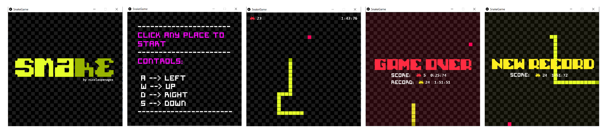
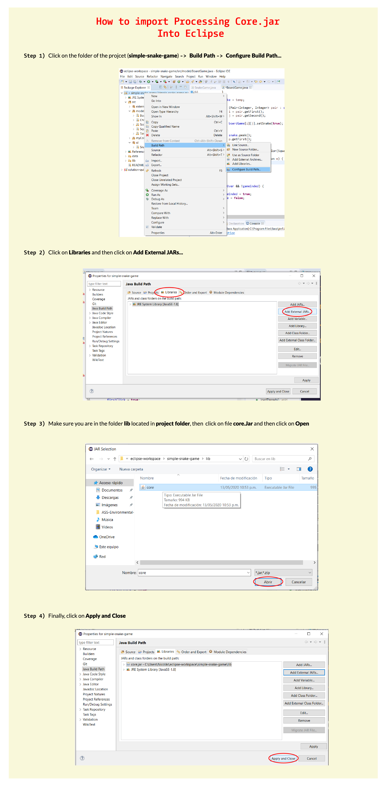

# simple-snake-game
As a hobby, I present a simple implementation of the classic Snake video game inspired by the pre-recorded versions on Nokia phones in the earliest 2000.

The main objective of the game is very simple, you have to eat as many enemies in the shortest time possible. Your best record will always be saved. The controls are very basic, use A, W, S, D or the arrows to move, press space if you want to increase the speed.

## Made by
  <ul>
  <li>
<a href="https://github.com/nicolaspenagos" title="Nicolas Penagos">Nicolás Penagos</a>   
</li>
  </ul> 
     
   nicolas.penagosm98@gmail.com 

## Important Information 
For the implementation of this project, I have used Proccessing technology, for this reason, I will ask you to manually add the external JAR. Below you will find the instructions to do so using Eclipse.

